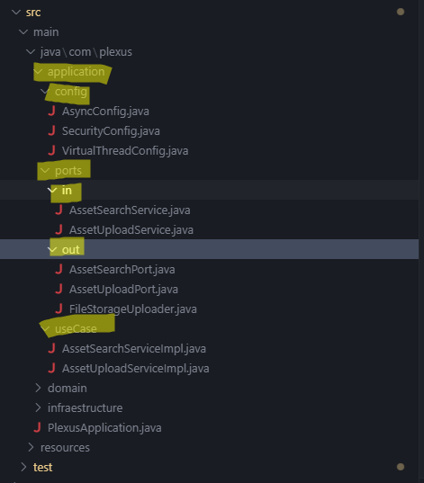
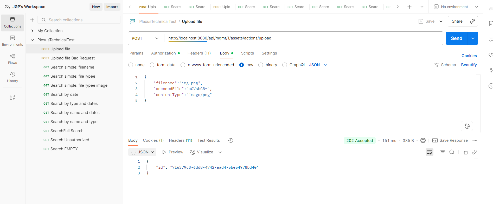

# Technical Test Plexus

## Maven proyect with Java 21

This repository contains a Spring Boot application built with Java 21.
Java 21 was chosen because it is the most up-to-date long-term-support version, works seamlessly with Spring Boot, and provides Virtual Threads, which are leveraged in the application to improve performance for asynchronous operations.

The project exposes two endpoints: a POST and a GET.
As specified, the POST endpoint persists metadata in a database so that uploaded files can later be queried, while the actual file upload is delegated to another (mocked) service.

### Requieremnts
- Java 21 (JDK 21)
- Apache Maven 3.9+


## Hexagonal design
The design has the 3 main layers:application, infraestructure and domain

- Application: The internals behavior of the application, definitions and interfaces
- - config
- - - Threads and async behavior
- - ports
- - - These contains the in ports, the contract with the client, the deffinition of what will the app do
- - - And also the out ports: he definition of what will we need from external services (suchs as aws or the database)
- - useCase
- - -  This would be the adapters of the contract/services defined in the "in" ports above


- Domain: The working classes
- - exception
- - - The custom exceptions
- - model
- - - Definition of internal working objects 
- - - Objects that we recieve
- - - Objects that we send


- Infraestructure: Communication in and out of the app. Models and external classes
- - persistance
- - - Entity: database entities
- - - Mapping: translating from the entites to dtos
- - - Repository: Database repositories
- - - Adapters: implementations of the interfaces defined in application using the repositories
- - Storage: Implementation of the interfaces from application to connect with the external middleman for the upload (mock)
- - Web
- - - Controller: Controller with Assets Endpoints
- - - Exception: Exception handler

## Database Description
The application uses an in-memory H2 database, whose structure is as it follows:
##### NOTE:
Although this demo uses WebFlux, the H2 database still generates blockages. The Schedulers.boundedElastic()
was implemented to prevent the blockage of the Netty Event Loop. It's not optimal, but initially, using JPA
whit H2 was easier for the development, WebFlux was implemented attending the optional specifications, and it 
would benefit more with Spring Data R2DBC repositories.


### ASSETS
The database was initialized with some registers to facilitate testing


## REST Endpoints
This application provides the 2 specified endpoints as requested in openapi.yml
You can also check the SwaggerUI by accessing http://localhost:8080/swagger-ui/index.html while the code is running;


### POSTMAN COLLECTION TO TEST IT
The collection is ready to import and test (local enviroment):
[Dowload file: POSTMAN COLLECTION FOR TESTING](src/main/resources/postman/PlexusTechnicalTest.postman_collection.json)



As stated in the requirements, the actual upload of the file would be delegated in another unespecified service,
so it's not properly implemented, just mocked.
 


##TESTS
The proyect includes a batery of unitary and integration test, with a total 
coverage of 93%. It was generated using JaCoCo, although SonarQube or simmilars are 
recommended.


### Construir
JaCoCo: target/site/index.html
```bash
mvn -v
mvn clean verify
```

### Execute (develop)
```bash
mvn spring-boot:run
```

### Package and JAR
```bash
mvn -q -DskipTests package
java -jar target/technicalTestPlexus-0.0.1-SNAPSHOT.jar
```

### Tests
```bash
mvn test
```

## Docker

### Requirements
- Docker Desktop instalado y ejecutándose
- Docker Compose v2.0+

### Executing Docker

The app is dockerized and ready to execute in containers
DockerDesktop has been used and therefore is recommended, there you can see clearly the states, cpu, memory, 
and execution logs
```bash
# Building and executing: make shure port 8080 is free
docker-compose up --build -d

# logs
docker-compose logs -f plexus-app

# Stopping
docker-compose down
```
#### Docker local execution :


## To be covered during the interview
#### Which improvements would you do to the API definition?

The main improvement would be providing some examples of actual values since the definition in both 
the openapi.yml and the TEST.md of what kind of files we'll be using or the dates format are too ambiguous
But I liked the concept of giving the API definition in an openApi format as sort of the "contract" with a client.

#### How would you include paging?

In order to include paging, i would do it on the GET enpoint for the search: 
adding 2 new parameters, pages and size, which Spring should automatically convert into a Pageable object wich
I could use later in the query.
In this case, the response would look like something like this:

```json
{
  "content": [ { "id": "1", "filename": "img.png", ... } ],
  "page": 0,
  "size": 10,
  "totalElements": 153,
  "totalPages": 16,
  "sort": "uploadDate,DESC"
}
```